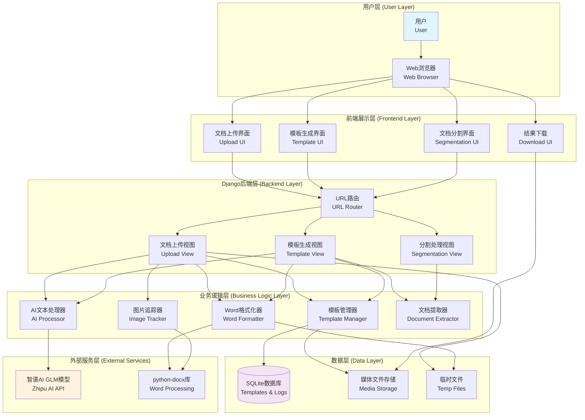
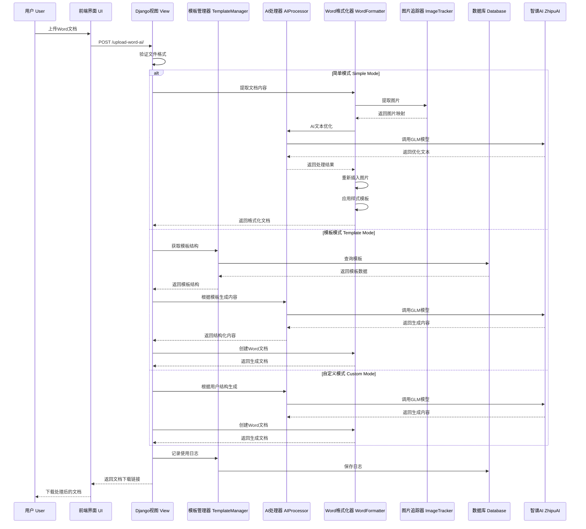
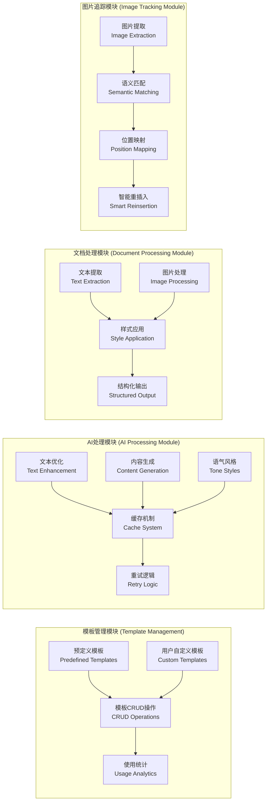
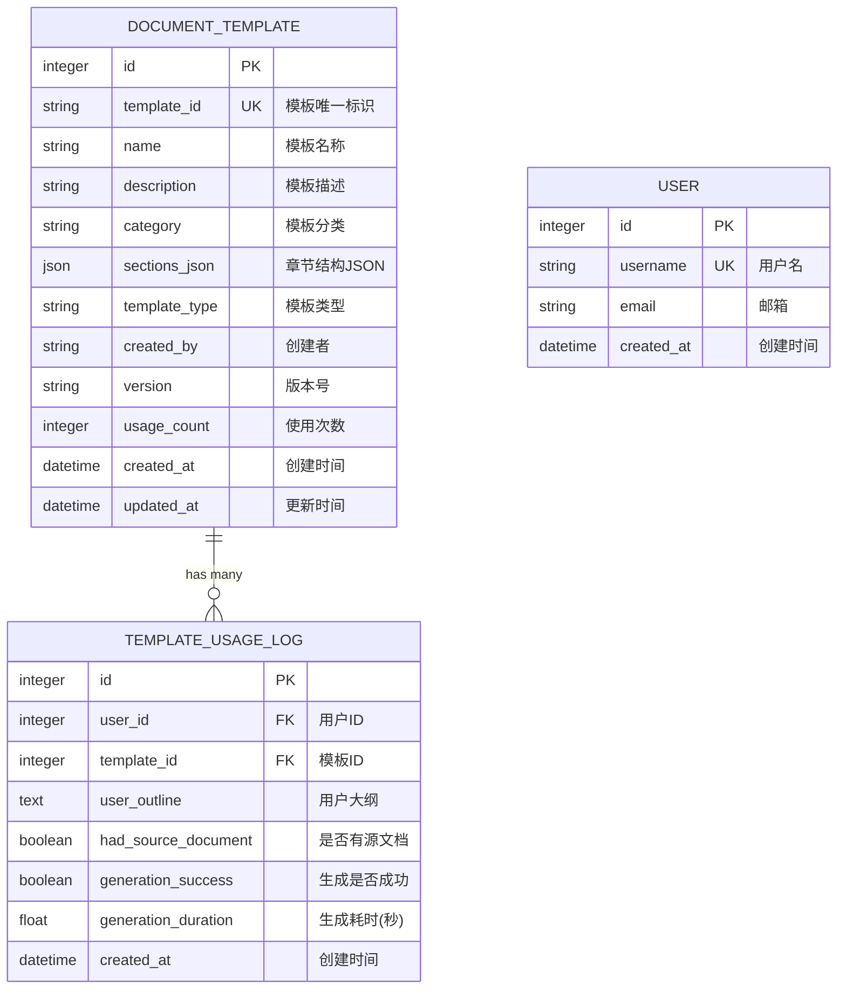
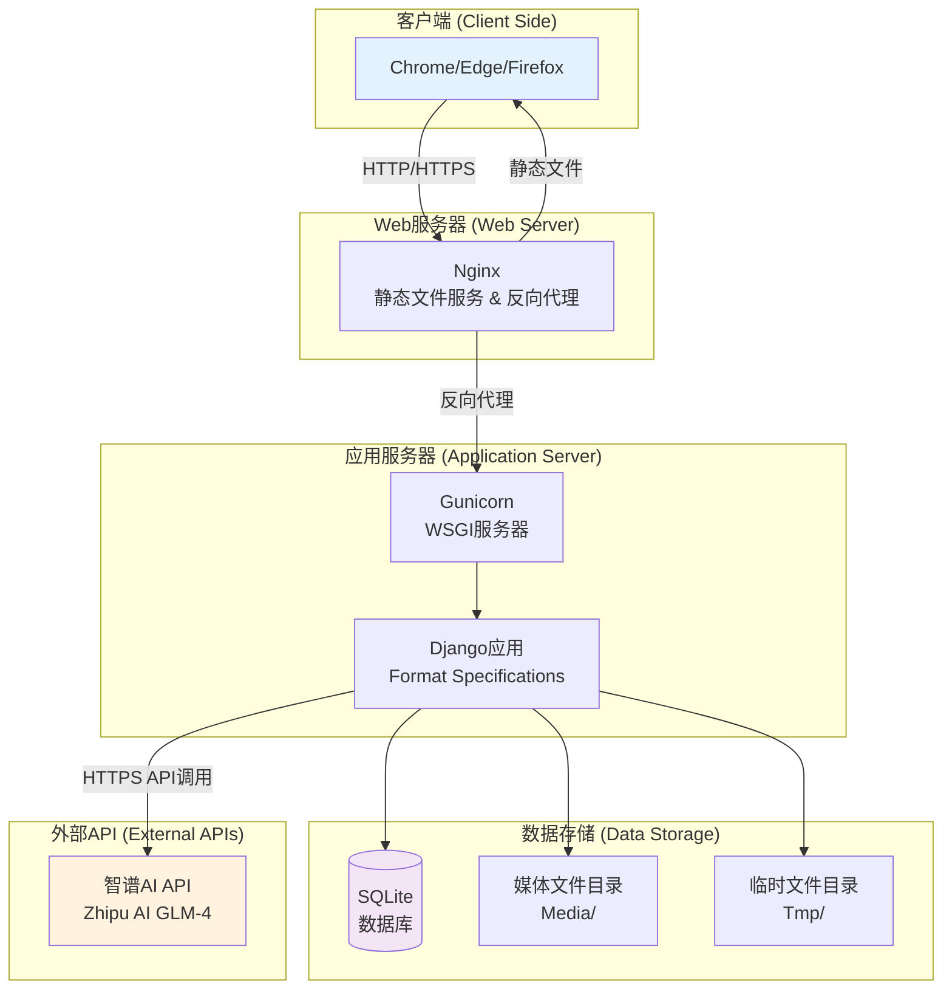

# 系统架构逻辑图
# System Architecture Diagram

## 1. 整体架构图 (Overall Architecture)

## 2. 数据流图 (Data Flow Diagram)

## 3. 核心模块架构图 (Core Module Architecture)

## 4. 数据库模型关系图 (Database Schema)

## 5. 部署架构图 (Deployment Architecture)

## 6. 功能模块详细说明 (Module Details)

### 6.1 前端模块 (Frontend Module)

| 模块 | 功能 | 文件 |
|------|------|------|
| 文档上传 | 支持拖拽上传,文件验证 | upload_word_ai.html |
| 模板选择 | 展示10种预定义模板 | template_generation.html |
| 配置面板 | 样式选择,语气调整 | settings.html |
| 进度显示 | 实时显示处理进度 | progress.js |
| 结果下载 | 支持中文文件名 | download.js |

### 6.2 后端服务模块 (Backend Services)

| 服务 | 职责 | 主要类/函数 |
|------|------|------------|
| 模板管理 | 模板CRUD,缓存 | TemplateManager |
| AI处理 | 文本生成,优化 | AIWordUtils |
| 文档格式化 | Word文档处理 | WordFormatter |
| 图片追踪 | 图片提取和重插入 | ImageTracker |
| 文档提取 | 内容提取和分析 | DocumentExtractor |

### 6.3 预定义模板列表 (Predefined Templates)

1. 年度工作总结 (Annual Work Summary)
2. 项目总结报告 (Project Summary Report)
3. 会议纪要 (Meeting Minutes)
4. 工作计划 (Work Plan)
5. 周报/月报 (Weekly/Monthly Report)
6. 调研报告 (Research Report)
7. 问题分析报告 (Problem Analysis Report)
8. 培训总结 (Training Summary)
9. 活动策划 (Event Planning)
10. 竞品分析 (Competitor Analysis)

### 6.4 AI功能特性 (AI Features)

- **多种语气风格**: 直接(Direct), 严谨(Rigorous), 共情(Empathetic), 专业(Professional)
- **智能缓存**: 避免重复API调用,降低成本
- **重试机制**: 指数退避重试,提高可靠性
- **超时控制**: 可配置的请求超时时间
- **错误处理**: 优雅降级,用户友好的错误提示

### 6.5 文档处理能力 (Document Processing Capabilities)

- **格式支持**: Microsoft Word (.docx)
- **图片处理**: 提取、语义匹配、智能重插入
- **样式模板**: 公文、学术、商务、休闲等多种风格
- **文本分割**: 段落、句子、语义单元三种模式
- **元数据保留**: 保存文档结构、格式信息

## 7. 技术栈 (Technology Stack)

### 前端技术 (Frontend)
- HTML5/CSS3
- Vanilla JavaScript
- Bootstrap (可选)
- jQuery (可选)

### 后端技术 (Backend)
- Python 3.x
- Django 6.0
- WSGI: Gunicorn

### 数据库 (Database)
- SQLite (开发环境)
- PostgreSQL/MySQL (生产环境推荐)

### 核心库 (Core Libraries)
- python-docx: Word文档处理
- httpx: HTTP客户端
- pydantic: 数据验证
- pillow: 图像处理

### AI服务 (AI Services)
- 智谱AI GLM-4 模型
- 自定义SDK集成

## 8. 性能优化策略 (Performance Optimization)

1. **AI缓存机制**: 相同内容不重复调用API
2. **异步处理**: 长时间任务异步执行
3. **临时文件管理**: 及时清理临时文件
4. **数据库索引**: 模板查询优化
5. **静态资源**: CDN加速(可选)
6. **连接池**: HTTP客户端连接复用

## 9. 安全性考虑 (Security Considerations)

1. **文件上传验证**: 文件类型、大小限制
2. **API密钥保护**: 环境变量存储
3. **SQL注入防护**: Django ORM参数化查询
4. **XSS防护**: 模板自动转义
5. **CSRF保护**: Django内置CSRF中间件
6. **错误日志**: 敏感信息不暴露给用户

---

**文档版本**: 1.0
**最后更新**: 2026-01-20
**维护者**: Format Specifications Team
